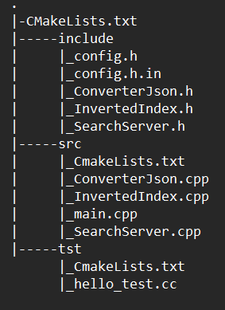
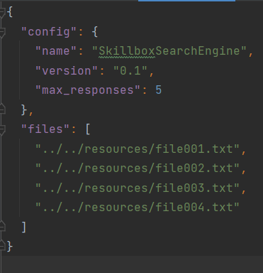
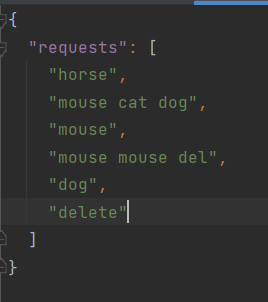
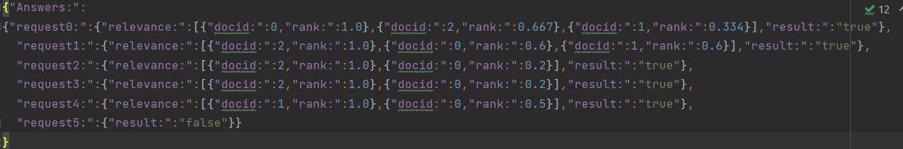
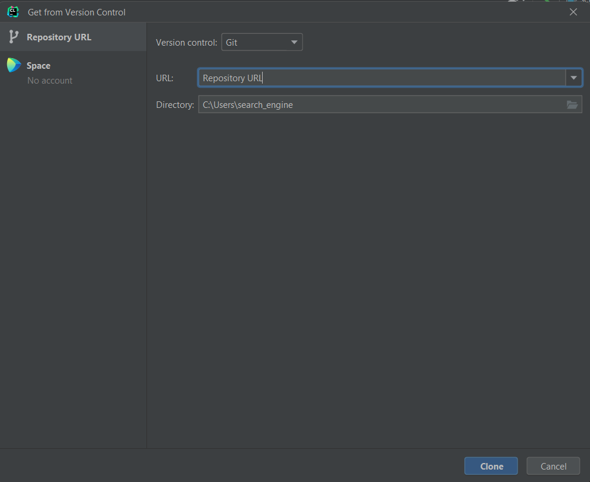
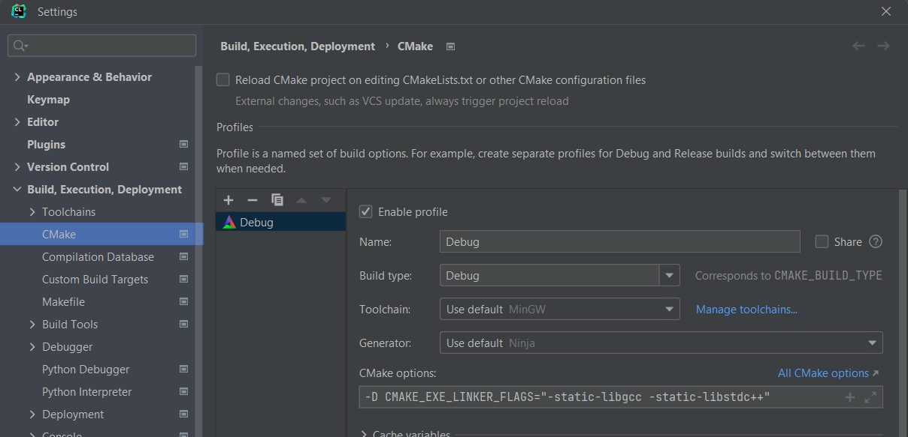
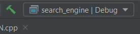

<h1 align="center">Описание</h1>

<body>Это поисковая система по кооперативному порталу компании реализованная на С++. 

Данная работа является итоговым учебным проектом, в нем реализовано:

<li>Обход поисковой системой файлов по которым надо произвести поиск

<li>Индексация каждого файла

<li>Поиск в индексах тех документов, в которых фигурируют слова из запроса

<li>Результат поиска ранжируется, сортируется и формируется в отдельном файле answers.json

<h1 align="center">Структура проекта</h1>

<h1 align="center">JSON файлы</h1>

Для работы c JSON файлами используется <a href="https://github.com/nlohmann/json">JSON for Modern C++</a>(присутствует в проекте).

Для успешной работы необходимо создать следующие JSON файлы:

1. Config.JSON - файл конфигурации.

<li>"name" - поле с названием поискового движка

<li>"version" - поле с версией поискового движка

<li>"max_pesponses" - поле с максимальным количеством ответов на один запрос(по умолчанию пять)

<li>"files" - список файлов по которым выполняется поиск(в каждом файле не более 1000 слов, максимальная длинна слова 100 символов)

2. requests.json - файл со списком поисковых запросов.

<li>"requests" - поле со списком поисковых запросов(не более 1000, в каждом не более 10 слов)

3. answers.json - файл с результатами поиска.

<li>"answers" - поле со списком результатов поиска

<li>"request0...999" - поле с ответами на каждый запрос в порядке размещения в файле requests.json

<li>"relevance" - список результатов, при наличии нескольких, найденных, документов, в порядке убывания поискового рейтинга

<li>"docid" - id документа, в порядке размещения в файле config.json

<li>"rank" - поисковой рейтинг

<h1 align="center">Unit-testing</h1>

Для unit-testing используется <a href="https://github.com/google/googletest">GTest</a>(загружается при сборке)

<h1 align="center">Потоки</h1>

Индексация файла, ранжировка и сортировка результата поиска происходит в многопоточном режиме реализованного с помощью библиотеки std::thread.

<h1 align="center">Установка на примере IDE Clion</h1>

1. С помощью инструмента для загрузки из удаленного репозитория, разместим исходные файлы в удобный каталог. <a href="https://github.com/Sereys13/search_engine/tree/main">Ссылка на репозиторий</a> 

2. В настройках Cmake для линковки библиотек в исполняемый файл добавим

<mark>-D CMAKE_EXE_LINKER_FLAGS="-static-libgcc -static-libstdc++"</mark>

3. Выполняем сборку проекта, сформировываем исполняемый файл search_engine.exe 

<h1 align="center">Настройка и запуск</h1>

1. Перенесите исполняемый файл в рабочий каталог.

2. Сформируйте и разместите конфигурационный файл config.json по примеру выше

3. Сформируйте и разместите файл request.json по примеру выше

4. Запустите исполняемый файл

5. При успешной запуске будет сформирован файл с ответами по запросу answers.json

<h1 align="center">Ограничения в работе кода</h1>

1.С прекращением работы поисковой системы:

<li>Отсутствие config.json

<li>Отсутствие поля config в config.json

<li>Несовпадение версии поискового движка(указанной в config.json) с версией самого приложениям

2.С продолжением работы поисковой системы:

<li>Отсутствие файлов по которым надо произвести индексацию

<li>Отсутствие файла request.json

<li>Превышение количества слов(более 1000) в файле для индексации

<li>Превышение количества символов в слове(более 100) в файле для индексации

<li>Превышение количества запросов(более 1000) в файле request.json

<li>Превышение количества слов в запросе(более 10) в файле request.json

</body>
